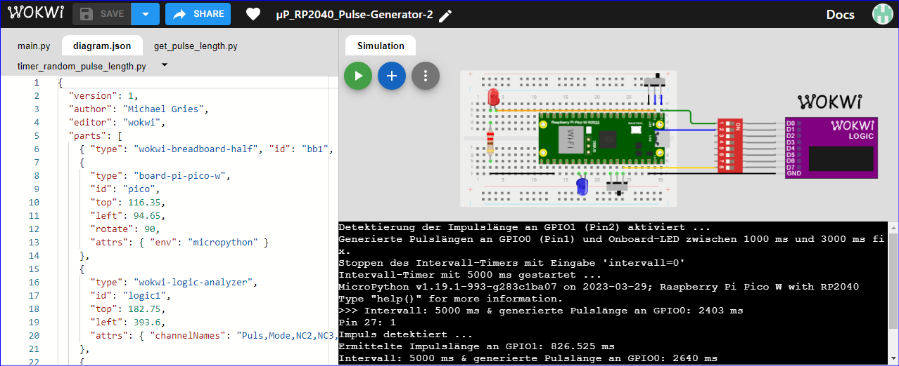
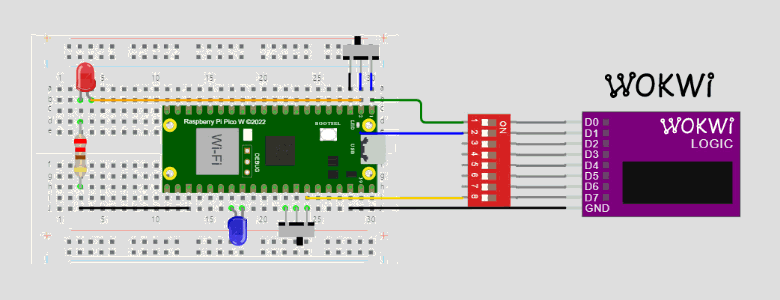

# µP_RP2040_Pulse-Generator-2 (type 2)

see [µP_RP2040_Pulse-Generator](https://github.com/griemide/simulation/tree/main/%C2%B5P_RP2040_Pulse-Generator) (type 1) for details

## Public project
WOKWI Homepage - Project [µP_RP2040_Pulse-Generator-2](https://wokwi.com/projects/363352758307109889)

### Browser

### Simulation results

### Local Backup files
GitHub: griemide  - repository [github.com/griemide/simulation/µP_RP2040_Pulse-Generator-2](https://github.com/griemide/simulation/blob/main/%C2%B5P_RP2040_Pulse-Generator-2/%C2%B5P_RP2040_Pulse-Generator-2.zip) - Download ZIP-file 
