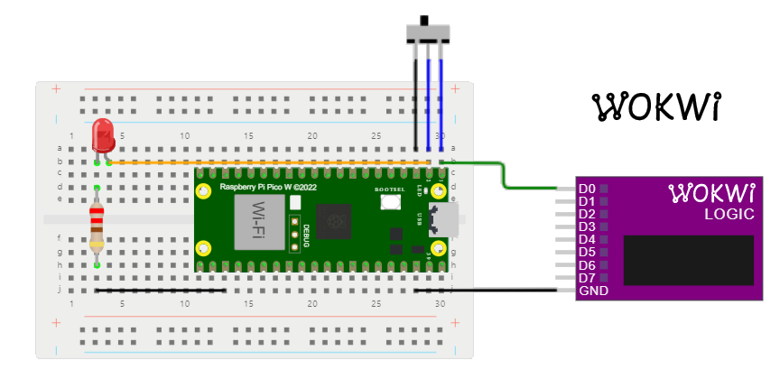

# µP_RP2040_Pulse-Generator

## Online Project
WOKWI Homepage - own (public) project [µP_RP2040_Pulse-Generator](https://wokwi.com/projects/363282075914340353)

## Description

## Simulation sequence
* captured simulation [MP4-video](µP_RP2040_Pulse-Generator.mp4) - built with Camtasia Studio 8 by TechSmith (needs to be downloaded for viewing)  
* captured simulation [AVI-video](µP_RP2040_Pulse-Generator.avi) - built with Camtasia Studio 8 by TechSmith (needs to be downloaded for viewing)
* captured simulation [GIF-video](µP_RP2040_Pulse-Generator.gif) - built with Camtasia Studio 8 by TechSmith (see below)

. . . .  

## VCD sequence

File [wokwi-logic µP_RP2040_Pulse-Generator.vcd]("wokwi-logic (µP_RP2040_Pulse-Generator).vcd")
